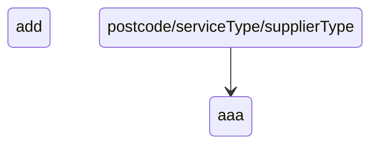

ChessBoard

A mini chessboard application made with React which highlights the valid squares that a knight can move to from a given square.
An attempt to follow 

Tech:
React JS

Hosted URL: https://mini-chessboard.netlify.app/

